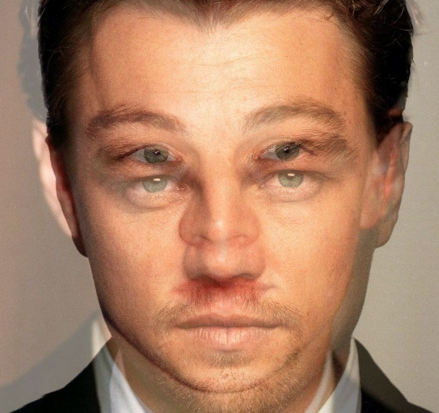
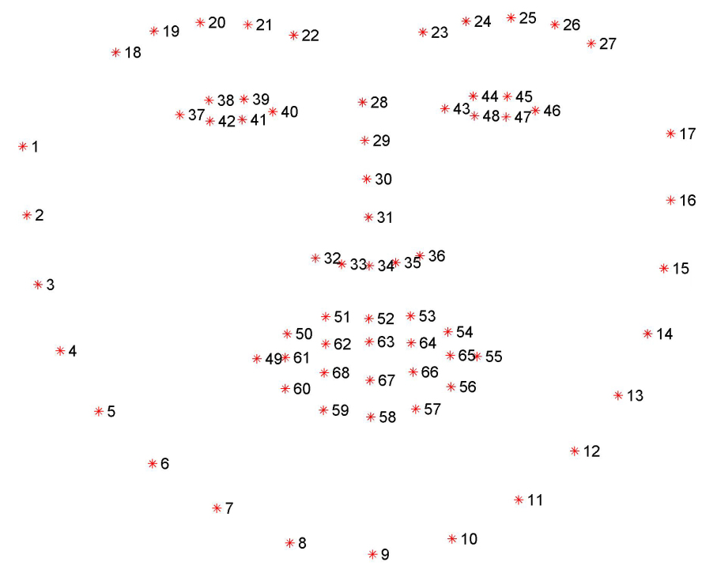
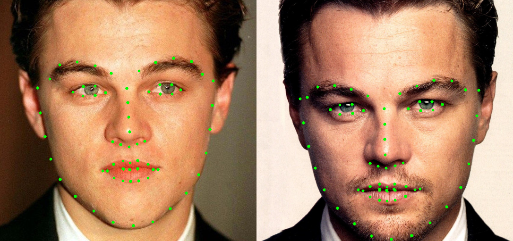
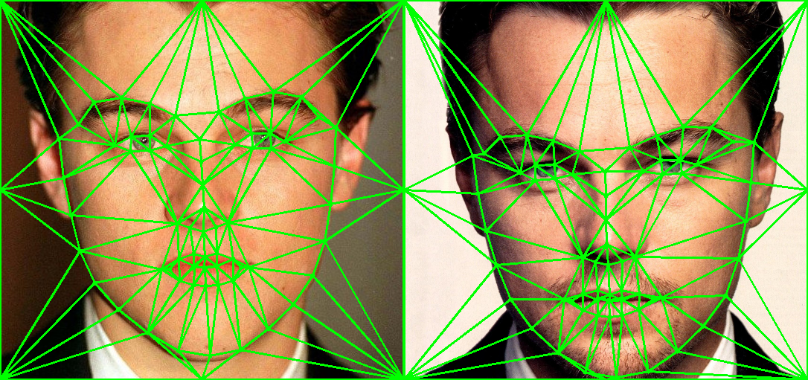
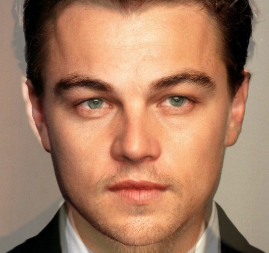
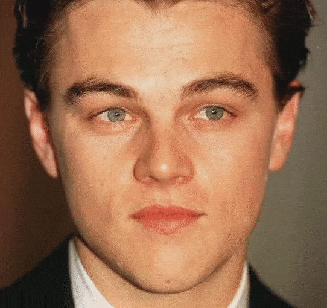

# FaceMorphing

This face morphing is built based on the article and code reference provided at [FaceMorphing](https://www.learnopencv.com/face-morph-using-opencv-cpp-python/). This is a CMake project.

Face morphing is basically to transform from one face to another seamlessly. A basic face morphing involves blending of two images at a variable rate. But a simple blending will result in undesirable results because of the misalignment in the facial features. A basic blending without facial alignment will look like below:

​      								Figure 1. Simple blending of two images without facial alignment.

In order to avoid this double face errors we will make use of facial landmark detection and aligning the faces to produce better results. Steps of face morphing are given below.

#### 1) Facial Landmark detection:

Facial landmark detection is the task of detecting key landmarks on the face and tracking them. I have used a 68-point facial landmark detector to identify landmarks on the face. 68-point detector localises regions along the eyes, eyebrows, nose, mouth and jawline as below:

​													Figure 2: A generic 68-point facial landmark detection

​												Figure 3: An example of 68-point facial landmark detection

#### 2) Delaunay triangulation:

[Delaunay triangulation](https://en.wikipedia.org/wiki/Delaunay_triangulation) helps us to divide the facial region into triangles and morph them correspondingly.
Each triangle is blended with corresponding triangle in the other image to produce aligned results.

​													Figure 4. An example of delaunay triangulation.

#### 3) Estimating Affine transformation between triangles and blending:

Now that we have got the triangles, we can estimate the affine transformation between every corresponding triangle in source image and intermediate (result ) image and  between every triangle in destination image and intermediate image. After affine transform estimation we can warp the triangle on to the intermediate image from both source and destination. Then blend the triangles to get the final morphed image.

​												Figure 5: Morphed image with alpha = 0.5

#### Making a transformation video:

Run alpha from 0 to 1 at a specific rate (< 0.03 for better results) and put the frames into a video to obtain the face transformation video. 

​																	Figure 6. A face morphing video.

